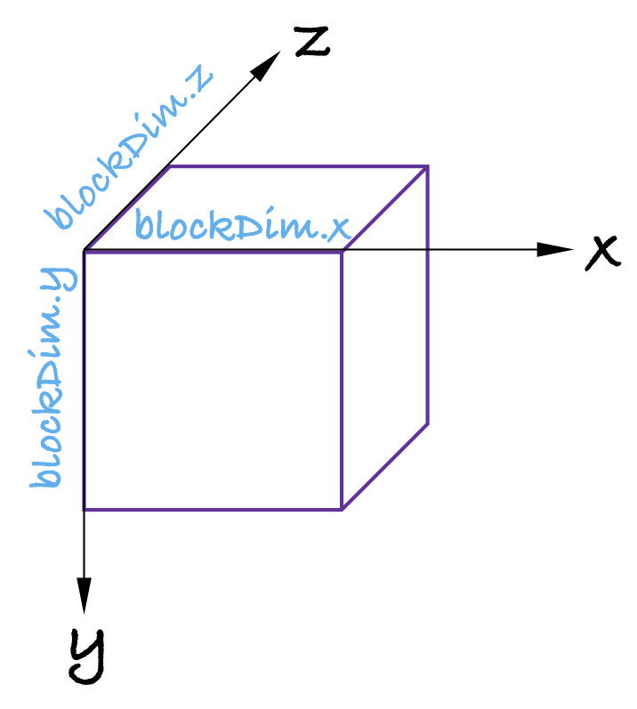

如Fig.1所示，在CUDA编程模型中，一个CTA可以用$\text{threadIdx.x}$, $\text{threadIdx.y}$, $\text{threadIdx.z}$ 三个逻辑坐标去索引。 可以把一个CTA内的线程编号想象成一个的三维的整型Tensor，这个Tensor的形状是：$[\text{blockDim.x}, \text{blockDim.y}, \text{blockDim.z}]$， 三个维度的跨度（stride）是$[1, \text{blockDim.x}, \text{blockDim.y}*\text{blockDim.z}]$，于是给定逻辑坐标：$(x, y, z)$，对应的一维线程坐标是：

$$\text{threadId} = x+y*\text{blockDim.x}+z*\text{blockDim.y}*\text{blockDim.z}$$

线程编号连续的32个线程为一个线程束。一个线程束内的线程访问Global Memory时，如果内存地址是连续的，访问将会被合并成内存事务。